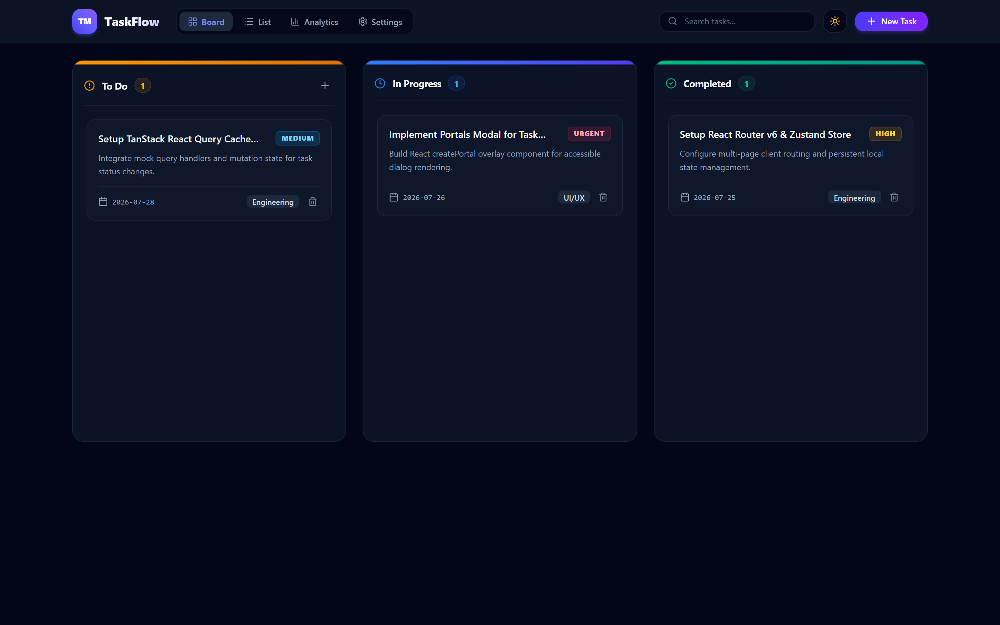
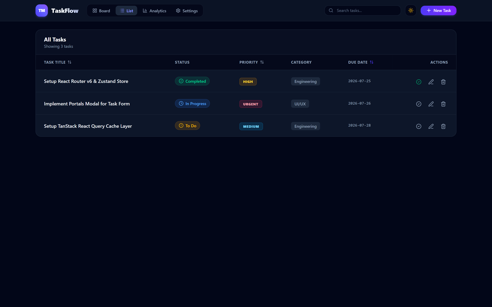
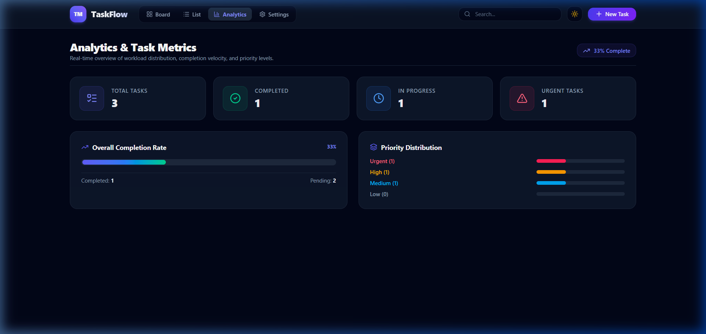
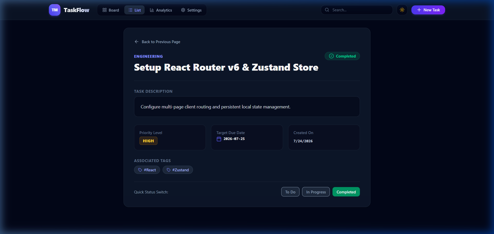
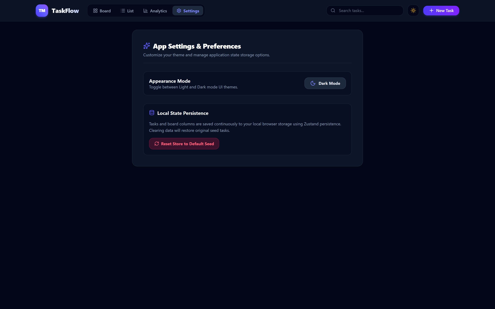

# TaskFlow — React Task Manager SPA

> **Project 01 of TaskFlow Suite**  
> A high-performance, responsive React 19 Task Manager application featuring an interactive Kanban Board with Drag-and-Drop, Data Table List view, Real-time Analytics, and persistent state management.

---

## Visual Preview & Screen Views

The application implements the unified **TaskFlow Design System** (Glassmorphism, Slate dark/light surface tokens, Indigo/Violet accents, and color-coded priority badges).

### 1. Interactive Kanban Board View (`/`)
Featuring smooth drag-and-drop status column re-ordering (`@hello-pangea/dnd`), real-time search filtering, priority badges, and quick-add actions.



---

### 2. Tabular Task List View (`/tasks`)
A structured data table view with multi-column sorting (Title, Priority, Due Date), status indicators, category badges, and row action controls.



---

### 3. Analytics & Task Metrics (`/analytics`)
Real-time completion velocity tracking, workload distribution overview, and priority breakdown.



---

### 4. Deep-Linked Task Detail View (`/tasks/:id`)
Detailed task view displaying tags, target due dates, category breadcrumbs, description context, and quick status switching controls.



---

### 5. Settings & Theme Preferences (`/settings`)
Appearance mode customization (Light / Dark mode toggle) and local Zustand state persistence controls.



---

## Features & Capabilities

- **Interactive Drag-and-Drop Kanban Board**: Drag tasks across `To Do`, `In Progress`, and `Completed` columns with optimistic state updates.
- **Dual View Modes**: Seamless toggle between Kanban Board layout and structured Task List table.
- **Real-Time Analytics Dashboard**: Automatic calculation of overall completion rates, urgent task flags, and priority distribution metrics.
- **Deep Linking & Routing**: React Router v7 integration supporting dynamic route parameters (`/tasks/:id`) and lazy-loaded Suspense chunks.
- **Persistent State**: Automated browser storage synchronization powered by Zustand state persistence middleware (`task-manager-zustand-store`).
- **Glassmorphic UI & Dark Mode**: Native system-aware theme toggle supporting both `slate-50` light mode and `slate-950` dark mode.
- **Accessible Modal Forms**: React Portals-based modal dialog for creating and editing task entries with inline validation and tag management.
- **Error Boundaries**: Resilient React error catching boundary fallback UI.

---

## Technology Stack

| Layer | Technology |
| :--- | :--- |
| **Framework** | React 19 (TypeScript) |
| **Build Tool** | Vite 8 + Fast Refresh |
| **Routing** | React Router v7 (`BrowserRouter`, `Routes`, `Route`, `lazy`, `Suspense`) |
| **State Management** | Zustand 5 (`persist` middleware) |
| **Data Fetching / Caching** | TanStack React Query v5 |
| **Drag & Drop** | `@hello-pangea/dnd` |
| **Styling & Design System** | Tailwind CSS v4 + Vanilla CSS Custom Glassmorphism (`.glass-panel`) |
| **Icons** | Lucide React (`lucide-react`) |

---

## Getting Started

### Prerequisites
- Node.js 18+ and `npm`

### Installation & Setup

1. Install dependencies:
   ```bash
   npm install
   ```

2. Start local development server:
   ```bash
   npm run dev
   ```
   Open `http://localhost:5173` in your browser.

3. Build production bundle:
   ```bash
   npm run build
   ```

4. Lint code:
   ```bash
   npm run lint
   ```

---

## Project Structure

```
01-task-manager-react/
├── screenshots/             # Application view screenshots
│   ├── analytics.png
│   ├── kanban-board.png
│   ├── settings.png
│   ├── task-detail.png
│   └── task-list.png
├── src/
│   ├── components/          # Reusable UI components (ErrorBoundary, TaskFormModal, Modal)
│   ├── context/             # ThemeContext (Dark/Light mode context provider)
│   ├── hooks/               # Custom hooks (useDocumentTitle, useDebounce)
│   ├── routes/              # Route views (KanbanBoard, TaskList, TaskDetail, Analytics, Settings)
│   ├── store/               # Zustand task state store (useTaskStore.ts)
│   ├── types/               # TypeScript interfaces & types (task.ts)
│   ├── App.tsx              # Main layout, router configuration & providers
│   ├── index.css            # Base Tailwind styles & glassmorphic utilities
│   └── main.tsx             # Application entry point
├── package.json
├── tailwind.config.js
├── tsconfig.json
└── vite.config.ts
```
