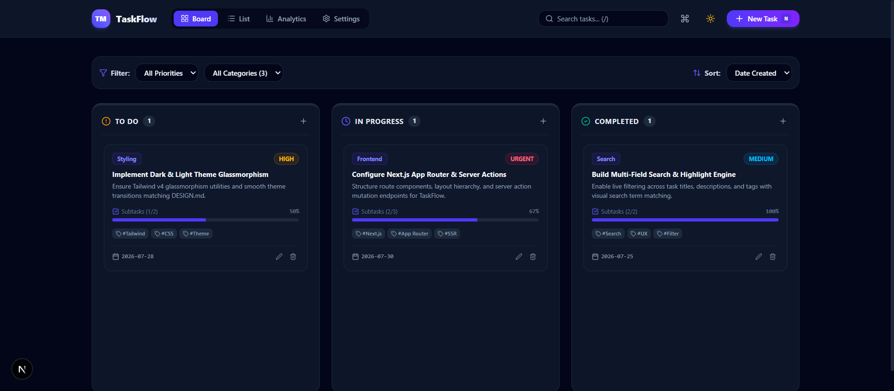
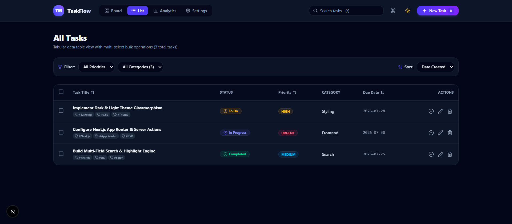
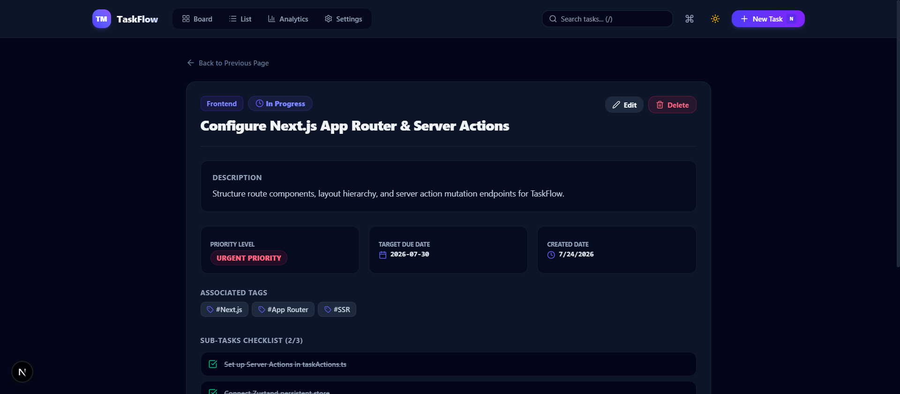
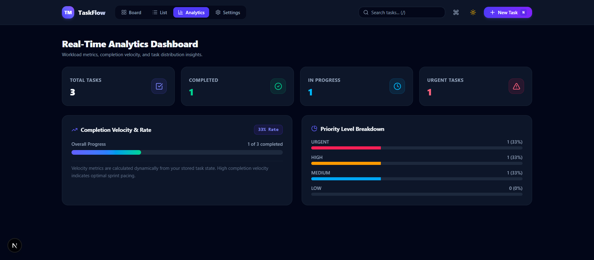
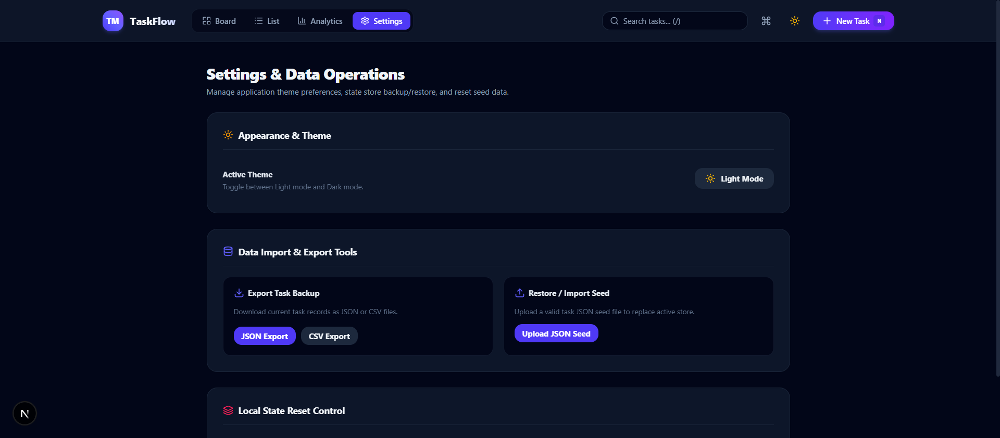

# TaskFlow — Next.js Task Manager App Router

> **Project 02 of TaskFlow Suite**  
> A production-ready, full-stack Next.js 15/16 Task Manager application featuring Next.js App Router architecture, Server Actions, REST Route Handlers, Edge Proxy, Dynamic Metadata, Streaming Loading states, Interactive Drag-and-Drop Kanban Board, Data Table with Bulk Operations, Real-time Analytics, and Data Import/Export.

---

## Visual Preview & Screen Views

The application implements the unified **TaskFlow Design System** (Glassmorphism, Slate dark/light surface tokens, Indigo/Violet accents, and color-coded priority badges).

### 1. Interactive Kanban Board View (`/`)
Featuring drag-and-drop status column re-ordering (`@hello-pangea/dnd`), status accent glowing borders, subtask progress bars, multi-field search filtering, priority badges, and quick-add actions.



---

### 2. Tabular Task List View (`/tasks`)
A structured data table view with multi-select bulk operations (batch status update, batch delete), multi-column sorting (Title, Priority, Due Date), status indicators, category badges, and row action controls.



---

### 3. Deep-Linked Task Detail View (`/tasks/:id`)
Detailed task view displaying SEO metadata generation (`generateMetadata`), tags, target due dates, category breadcrumbs, sub-tasks checklist toggle, activity timestamp log, and quick status switching controls.



---

### 4. Real-Time Analytics Dashboard (`/analytics`)
Real-time completion velocity tracking (`%`), 4 key metric cards, overall progress velocity bar, and priority level distribution breakdown.



---

### 5. Settings & Data Operations (`/settings`)
Appearance mode customization (Light / Dark mode toggle), local Zustand state persistence reset, and JSON/CSV data backup & upload restore tools.



---

## Next.js Features Reference & Architecture

This project covers all core Next.js App Router patterns for testing and reference:

| Feature Area | File Location | Description |
| :--- | :--- | :--- |
| **Server vs Client Components** | `src/app/page.tsx`, `src/components/...` | Clean boundary between SSR layouts/pages and interactive leaf components (`"use client"`). |
| **Server Actions** | `src/app/actions/taskActions.ts` | Server-executed mutation functions (`"use server"`) with cache revalidation (`revalidatePath`). |
| **REST Route Handlers** | `src/app/api/tasks/route.ts` & `[id]/route.ts` | Standardized API endpoints for GET, POST, PUT, DELETE operations returning JSON. |
| **Edge Proxy** | `src/proxy.ts` | Custom Edge proxy replacing deprecated middleware.ts in Next.js 16. |
| **Dynamic Metadata** | `src/app/tasks/[id]/page.tsx` | SEO page title and metadata generation for dynamic detail routes. |
| **Streaming Loading States** | `src/app/loading.tsx` | Pulse loading skeleton for instant streaming feedback. |
| **Custom Error & 404 Pages** | `src/app/error.tsx`, `src/app/not-found.tsx` | Interactive error recovery UI (`reset()`) and custom 404 page. |
| **Optimistic UI Updates** | `src/store/useTaskStore.ts` & Actions | React 19 / Zustand client optimistic state combined with server cache revalidation. |

---

## Extended Frontend Features ("Design.md Plus More")

- **Live Multi-Field Search & Highlight**: Search across titles, descriptions, categories, and tags (`/`) with shortcut `/`.
- **Interactive Sub-tasks & Checklists**: Sub-tasks with visual progress bar inside cards.
- **Activity Timestamp Log**: Historical record of task status updates, edits, and creation timestamps on detail pages.
- **Multi-Select Bulk Operations**: Select checkboxes in Task List view (`/tasks`) for bulk status updates or deletions.
- **Data Import & Export**: Download task data as JSON or CSV files, and restore/import JSON seed files (`/settings`).
- **Keyboard Shortcuts Engine**: Global hotkeys (`N` for new task, `/` for search, `B` for board, `L` for list, `?` for legend, `Esc` to close).
- **Toast Feedback System**: Dynamic action alert notifications (`success`, `info`, `warning`, `error`).
- **High-Contrast Mobile Navigation**: Fixed bottom navigation bar for mobile screens (`< 768px`) adhering to `/ui-ux-pro-max` standards.

---

## Technology Stack

| Layer | Technology |
| :--- | :--- |
| **Framework** | Next.js 15 / 16 (App Router + Server Actions + Route Handlers) |
| **Language** | TypeScript |
| **State Management** | Zustand 5 (`persist` middleware) |
| **Data Fetching / Caching** | TanStack React Query v5 |
| **Drag & Drop** | `@hello-pangea/dnd` (with `renderClone` portal dragging) |
| **Styling & Design System** | Tailwind CSS v4 + Vanilla CSS Custom Glassmorphism (`.glass-panel`) |
| **Icons** | Lucide React (`lucide-react`) |

---

## Getting Started

### Prerequisites
- Node.js 18+ and `npm`

### Installation & Setup

1. Navigate to project folder:
   ```bash
   cd projects/02-task-manager-nextjs
   ```

2. Install dependencies:
   ```bash
   npm install
   ```

3. Start local development server:
   ```bash
   npm run dev
   ```
   Open `http://localhost:3000` in your browser.

4. Build production bundle:
   ```bash
   npm run build
   ```

---

## Project Structure

```
02-task-manager-nextjs/
├── screenshots/             # Application view screenshots
│   ├── analytics.png
│   ├── kanban-board.png
│   ├── settings.png
│   ├── task-detail.png
│   └── task-list.png
├── public/                  # Static public assets
├── src/
│   ├── app/                 # Next.app App Router pages, layouts, actions & API routes
│   │   ├── actions/         # Server Actions (taskActions.ts)
│   │   ├── analytics/       # Analytics route (/analytics)
│   │   ├── api/             # REST API Route Handlers (/api/tasks)
│   │   ├── settings/        # Settings route (/settings)
│   │   ├── tasks/           # Tasks list & detail routes (/tasks, /tasks/[id])
│   │   ├── error.tsx        # Error boundary UI
│   │   ├── globals.css      # Tailwind CSS v4 & glassmorphic utilities
│   │   ├── icon.svg         # App Router icon metadata
│   │   ├── layout.tsx       # Root layout & ThemeProvider wrapper
│   │   ├── loading.tsx      # Pulse streaming skeleton
│   │   ├── not-found.tsx    # Custom 404 page
│   │   └── page.tsx         # Kanban Board route (/)
│   ├── components/          # UI Components (kanban, list, layout, common)
│   ├── context/             # ThemeContext (Dark/Light mode context provider)
│   ├── proxy.ts             # Next.js 16 Edge proxy
│   ├── store/               # Zustand task state store (useTaskStore.ts)
│   └── types/               # TypeScript interfaces & types (task.ts)
├── next.config.ts
├── package.json
├── postcss.config.mjs
├── README.md
└── tsconfig.json
```
