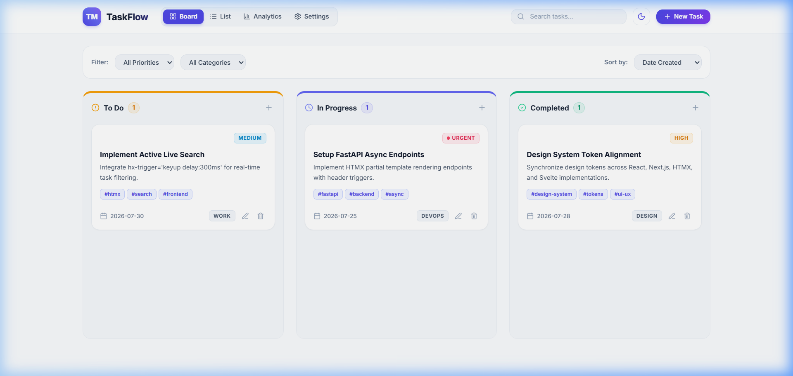
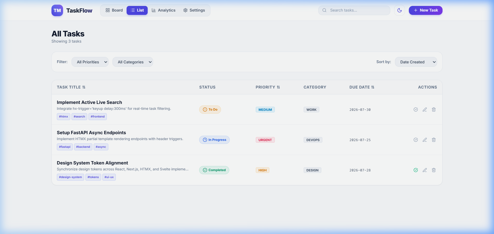
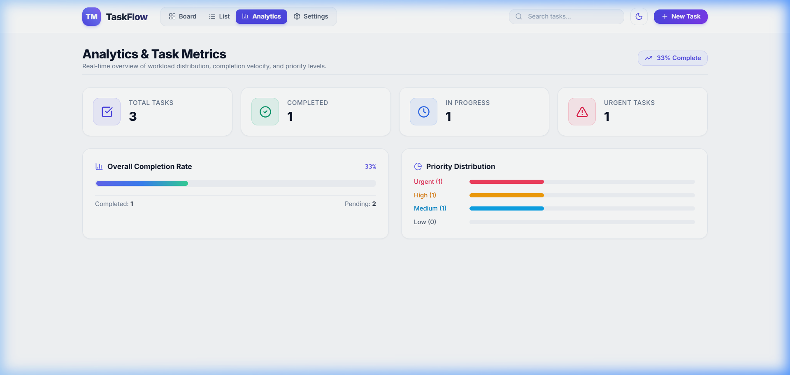
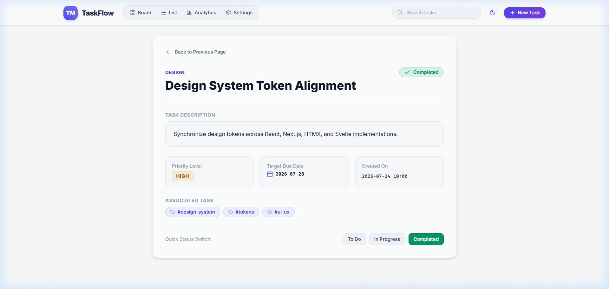
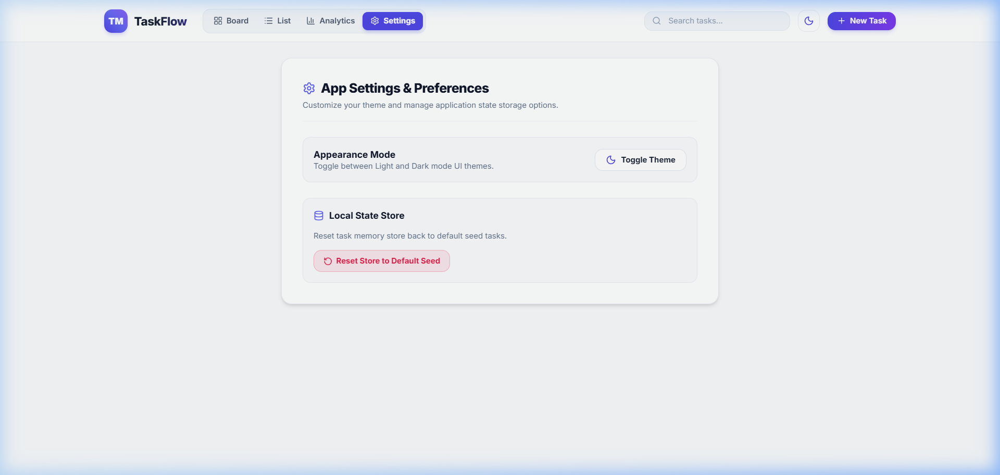

# Project 03: Task Manager (HTMX + FastAPI)

Part of the **TaskFlow Suite** (Projects 01-04). This project delivers a server-rendered Single Page Application (SPA) experience using **HTMX 2.0**, **FastAPI**, **Jinja2 Templates**, **Lucide Icons**, and **Tailwind CSS**.

---

## Screenshots

### 1. Kanban Board View


### 2. Task List Data Table View


### 3. Analytics & Task Metrics


### 4. Task Detail View


### 5. App Settings & Preferences


---

## Key Features & Capabilities

- **Unified Visual Design**: Adheres strictly to [`projects/DESIGN.md`](../DESIGN.md) glassmorphic standards (`.glass-panel`), slate/indigo color tokens, and responsive cards.
- **Lucide Icons Library**: Clean, modern vector iconography integrated across navigation, task cards, tables, analytics metrics, and notifications.
- **Dual View Modes**: Interactive **Kanban Board** (Todo, In Progress, Completed columns with drag-and-drop support) and structured **Data Table View** with dynamic view switching (`hx-get="/tasks?view=..."`).
- **Full Task CRUD**: Modal creation & editing, priority badges, category tags, due dates, and deletion with outerHTML swapping.
- **Active Search**: Real-time live search typing with `hx-trigger="keyup delay:300ms, search"`.
- **Filtering & Sorting**: Multi-parameter filter combo (Priority, Category, Sort by due date/created date/priority).
- **Out-of-Band (OOB) Notifications**: Action toasts injected dynamically using HTMX `hx-swap-oob="beforeend:#toast-container"`.
- **Dark Mode Parity**: Instant theme toggle with local storage persistence and FOUC prevention.

---

## Tech Stack

- **Frontend Interactivity**: HTMX 2.0.0 & SortableJS
- **Icons**: Lucide Icons Library
- **Backend API & SSR**: Python 3.10+ & FastAPI
- **Templating**: Jinja2
- **Styling**: Tailwind CSS & Custom CSS design tokens
- **Data Store**: In-Memory Task Engine (extensible to SQLite/PostgreSQL)

---

## How to Run Locally

1. Navigate to the project directory:
   ```bash
   cd projects/03-task-manager-htmx
   ```

2. Install dependencies:
   ```bash
   pip install -r requirements.txt
   ```

3. Run the development server with live reload:
   ```bash
   uvicorn app.main:app --reload --port 8000
   ```

4. Open your browser at [http://localhost:8000](http://localhost:8000).

---

## HTMX Architectural Patterns Used

| Pattern | HTMX Attributes Used | Description |
| :--- | :--- | :--- |
| **Live Active Search** | `hx-get="/tasks" hx-trigger="keyup delay:300ms, search"` | Filters task lists as user types without full page reload. |
| **Dynamic View Swap** | `hx-get="/tasks?view=list"` | Swaps main content between Kanban board and Data Table layout. |
| **Modal Form Portal** | `hx-get="/tasks/new" hx-target="#modal-container"` | Dynamically injects glassmorphic modal overlay into document body. |
| **Inline Status Shift** | `hx-post="/tasks/{id}/status"` | Re-renders Kanban columns when task status changes. |
| **OuterHTML Deletion** | `hx-delete="/tasks/{id}" hx-swap="outerHTML"` | Removes task DOM element cleanly upon server confirmation. |
| **OOB Toast Feedback** | `hx-swap-oob="beforeend:#toast-container"` | Appends toast alerts to the global notification container in parallel. |

---
