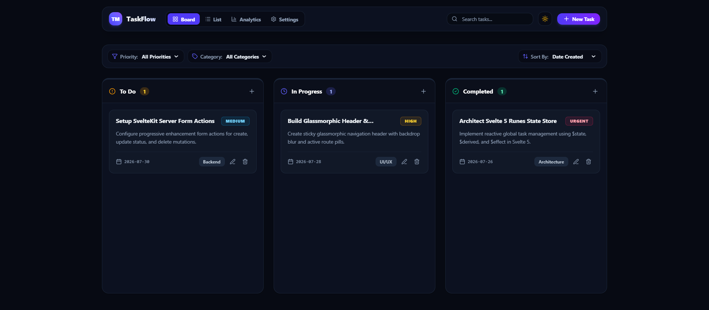
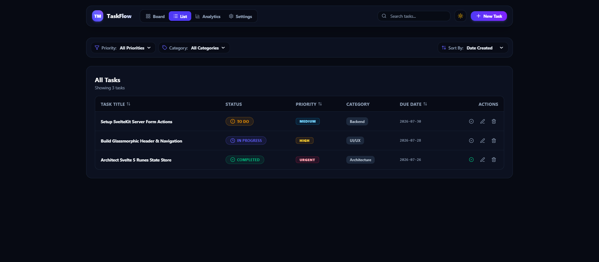
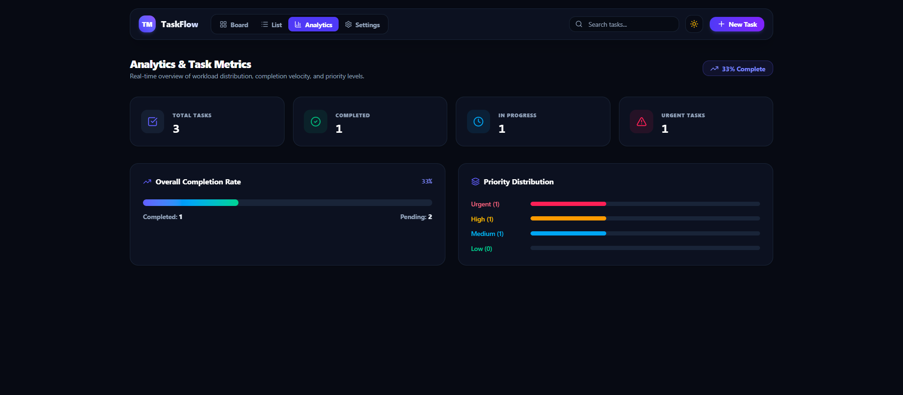
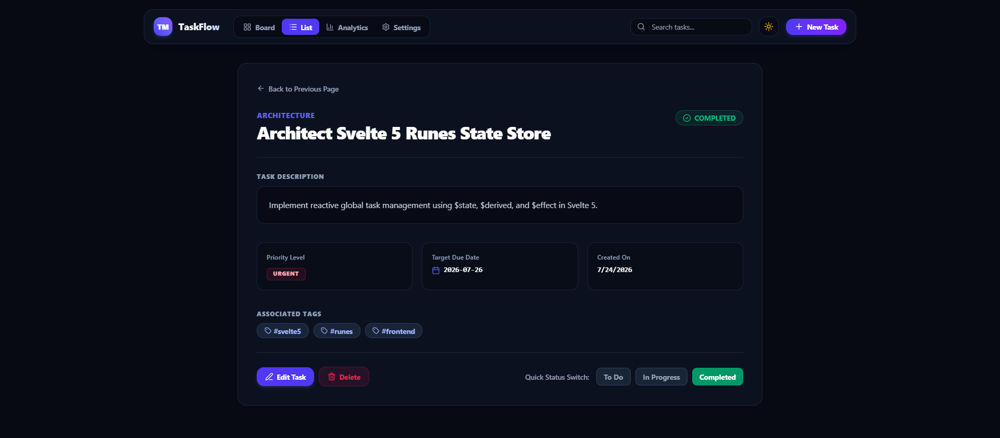
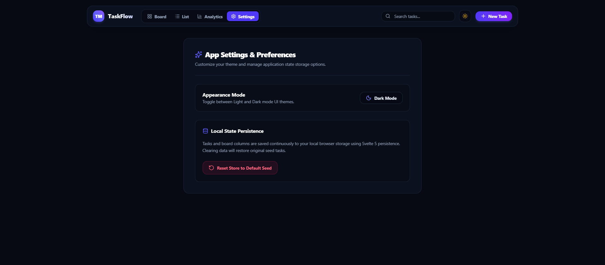

# TaskFlow — SvelteKit Task Manager App

> **Project 04 of TaskFlow Suite**  
> A full-stack, production-grade SvelteKit application featuring Svelte 5 Runes (`$state`, `$derived`, `$effect`), server load functions (`+page.server.ts`), progressive form actions (`use:enhance`), REST API endpoints (`+server.ts`), View Transitions API, and an interactive Kanban Board with Drag-and-Drop.

---

## Visual Preview & Screen Views

The application implements the unified **TaskFlow Design System** (Glassmorphism, Slate dark/light surface tokens, Indigo/Violet accents, and color-coded priority badges).

### 1. Interactive Kanban Board View (`/`)
Featuring smooth drag-and-drop status column re-ordering (`svelte-dnd-action`), real-time search filtering, priority badges, and quick-add actions.



---

### 2. Tabular Task List View (`/tasks`)
A structured data table view with multi-column sorting (Title, Priority, Due Date), status indicators, category badges, and row action controls.



---

### 3. Analytics & Task Metrics (`/analytics`)
Real-time completion velocity tracking, workload distribution overview, and priority breakdown.



---

### 4. Deep-Linked Task Detail View (`/tasks/:id`)
Detailed task view displaying tags, target due dates, category breadcrumbs, description context, and quick status switching controls.



---

### 5. Settings & Theme Preferences (`/settings`)
Appearance mode customization (Light / Dark mode toggle) and local Svelte 5 state store persistence controls.



---

## Features & Capabilities

- **Svelte 5 Runes Architecture**: Reactive state management built with Svelte 5 Runes (`$state`, `$derived.by()`, `$effect`, `$props`).
- **Server-Side Rendering & Form Actions**: Progressive enhancement using SvelteKit `+page.server.ts` Form Actions (`use:enhance`).
- **Native REST API Endpoints**: Modular server endpoints (`src/routes/api/tasks/+server.ts` & `[id]/+server.ts`) for `GET`, `POST`, `PATCH`, `DELETE`.
- **Interactive Drag-and-Drop Kanban Board**: Drag tasks across `To Do`, `In Progress`, and `Completed` columns using `svelte-dnd-action`.
- **View Transitions API Integration**: Smooth view transition page navigation powered by SvelteKit's `onNavigate` hook.
- **Server Middleware & Custom Headers**: Request timing and framework metadata injection via `src/hooks.server.ts`.
- **Real-Time Analytics Dashboard**: Automatic calculation of overall completion rates, urgent task flags, and priority distribution metrics.
- **Glassmorphic UI & Dark Mode**: Native system-aware theme toggle supporting both `slate-50` light mode and `#070a13` dark mode.
- **Accessible Compact Modals**: Form modal overlay with fixed header, scrollable body, and fixed accessible action footer.
- **Custom Error Boundaries**: Styled custom `+error.svelte` page for graceful 404 and 500 error handling.

---

## Technology Stack

| Layer | Technology |
| :--- | :--- |
| **Framework** | Svelte 5 (Runes) + SvelteKit |
| **Build Tool** | Vite 8 + SvelteKit Plugin |
| **Routing & SSR** | SvelteKit File-System Router (`+page.svelte`, `+page.server.ts`, `+layout.svelte`, `+server.ts`) |
| **State Management** | Svelte 5 Reactive Class Store (`taskStore.svelte.ts`) + `localStorage` Sync |
| **Drag & Drop** | `svelte-dnd-action` |
| **Styling & Design System** | Tailwind CSS v4 + `@tailwindcss/vite` + Vanilla CSS Custom Glassmorphism (`.glass-panel`) |
| **Icons** | Lucide Svelte (`lucide-svelte`) |

---

## Getting Started

### Prerequisites
- Node.js 18+ and `npm`

### Installation & Setup

1. Install dependencies:
   ```bash
   npm install
   ```

2. Start local development server:
   ```bash
   npm run dev
   ```
   Open `http://localhost:5174` in your browser.

3. Build production bundle:
   ```bash
   npm run build
   ```

4. Type check & Svelte check:
   ```bash
   npm run check
   ```

---

## Project Structure

```
04-task-manager-svelte/
├── screenshots/                 # Application view screenshots
│   ├── analytics.png
│   ├── kanban-board.png
│   ├── settings.png
│   ├── task-detail.png
│   └── task-list.png
├── src/
│   ├── lib/
│   │   ├── components/          # UI components (NavigationHeader, TaskCard, FilterToolbar, TaskFormModal, ToastContainer)
│   │   ├── data/                # Initial seed task dataset (seedTasks.ts)
│   │   ├── state/               # Svelte 5 Runes reactive store (taskStore.svelte.ts)
│   │   └── types/               # TypeScript interfaces & types (task.ts)
│   ├── routes/                  # SvelteKit routes & server handlers
│   │   ├── +layout.server.ts    # Root layout server load
│   │   ├── +layout.svelte       # Root layout shell with Header & View Transitions
│   │   ├── +page.server.ts      # Kanban Board server load & Form Actions
│   │   ├── +page.svelte         # Kanban Board view (`/`)
│   │   ├── +error.svelte        # Custom 404/500 error boundary page
│   │   ├── analytics/           # Analytics view (`/analytics`)
│   │   ├── api/tasks/           # REST API endpoints (`GET`, `POST`, `PATCH`, `DELETE`)
│   │   ├── settings/            # Settings view (`/settings`)
│   │   └── tasks/               # Task List (`/tasks`) & Detail (`/tasks/:id`)
│   ├── app.css                  # Base Tailwind CSS v4 styles & glassmorphism utilities
│   ├── app.html                 # HTML shell with favicon link
│   └── hooks.server.ts          # Server handle middleware hook
├── static/
│   └── favicon.svg              # SVG Favicon icon
├── package.json
├── svelte.config.js
├── tsconfig.json
└── vite.config.ts
```
