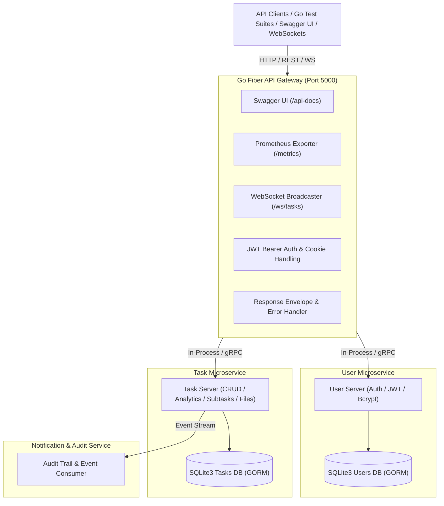

# Project 7: Task Manager API (Go Microservices)

High-performance, production-grade Go Microservices Backend API built with **Go Fiber** for the HTTP API Gateway, gRPC for inter-service communication, Protobuf schemas, and SQLite3 database (abstracted via GORM for seamless extension to PostgreSQL).

## Architecture Diagram



## Project Structure

```
projects/07-api-go-microservices/
├── go.work                          # Go Workspace configuration
├── api-gateway/                     # Go Fiber HTTP Gateway (Port 5000)
│   ├── cmd/main.go                  # Fiber app initialization & Swag root annotations
│   ├── docs/                        # Swag generated OpenAPI documentation package
│   ├── handlers/                    # Annotated HTTP Handlers (@Summary, @Router, @Param)
│   ├── metrics/                     # Prometheus telemetry middleware & exporter
│   ├── middleware/                  # Bearer Auth, CORS & Error recovery
│   └── swagger/                     # Official gofiber/swagger UI provider
├── user-service/                    # User Authentication & Token Service
│   ├── cmd/main.go                  # Service entrypoint
│   ├── server/                      # JWT creation, token refresh & bcrypt auth
│   └── repository/                  # GORM SQLite3 storage for Users & RefreshTokens
├── task-service/                    # Task Management & Workload Analytics Service
│   ├── cmd/main.go                  # Service entrypoint
│   ├── server/                      # Task CRUD, Subtasks, Bulk ops & Analytics logic
│   └── repository/                  # GORM SQLite3 storage for Tasks & Subtasks
├── shared/                          # Shared Models, Utilities & Protobuf schemas
│   ├── models/models.go             # Domain entity definitions
│   ├── proto/                       # Protobuf schemas (user.proto, task.proto)
│   └── utils/                       # Response envelopes & normalized error codes
├── tests/                           # Go Unit & Integration Test Suite
│   ├── auth_test.go                 # Registration, login, refresh & logout tests
│   ├── tasks_test.go                # Task CRUD, filtering, categories & analytics tests
│   └── files_and_ws_test.go         # File upload & WebSocket broadcast tests
└── README.md                        # Documentation
```

## API Endpoints (Base URL: `http://localhost:5000/api/v1`)

### Authentication
- `POST /auth/register` - Register a new user
- `POST /auth/login` - Authenticate user & receive access token + HttpOnly refresh cookie
- `POST /auth/refresh` - Refresh access token using HttpOnly cookie
- `POST /auth/logout` - Revoke refresh token & clear cookie
- `GET /auth/me` - Fetch authenticated user profile

### Tasks & Subtasks
- `GET /tasks` - List tasks with search, status/priority/category/tag filters & sorting
- `POST /tasks` - Create a new task
- `GET /tasks/:id` - Fetch single task details
- `PUT /tasks/:id` - Update task attributes
- `PATCH /tasks/:id` - Patch task attributes
- `DELETE /tasks/:id` - Delete task
- `POST /tasks/bulk-delete` - Batch delete tasks
- `PATCH /tasks/bulk-update-status` - Batch update task status
- `POST /tasks/:id/subtasks` - Create a subtask
- `PATCH /tasks/:id/subtasks/:subtaskId` - Toggle subtask completion status
- `DELETE /tasks/:id/subtasks/:subtaskId` - Delete a subtask

### Analytics & Metadata
- `GET /categories` - Retrieve dynamic deduplicated sorted list of categories
- `GET /analytics` - Calculate completion rate, velocity, and priority breakdown metrics

### Files & Real-time WebSockets
- `POST /files/upload` - Upload file attachment
- `GET /files/download/:id` - Download file attachment
- `GET /ws/tasks` - WebSocket connection for real-time task update broadcasts

### Documentation & Telemetry
- Interactive Swagger UI: `http://localhost:5000/api-docs/`
- Prometheus Metrics: `http://localhost:5000/metrics`
- Health Checks: `http://localhost:5000/healthz` and `http://localhost:5000/readyz`

## Code Annotation Driven Swagger Documentation (`swag`)

Documentation for all API Gateway endpoints is defined declaratively using Swag doc comments directly on top of handler functions in `api-gateway/handlers/*.go` (such as `@Summary`, `@Description`, `@Tags`, `@Param`, `@Success`, `@Router`).

To regenerate documentation after adding or modifying handler annotations, run:

```bash
go install github.com/swaggo/swag/cmd/swag@latest
cd api-gateway
swag init -g cmd/main.go -o docs
```

## Database Configuration

Database access is managed via GORM using SQLite3 for local development and zero-setup testing. The repository pattern separates database operations so that changing to PostgreSQL only requires updating the GORM driver initialization.

## Running Tests & Server

1. Sync workspace dependencies:
   ```bash
   go work sync
   ```

2. Run Go Test Suite:
   ```bash
   cd tests && go test ./... -v
   ```

3. Run API Gateway:
   ```bash
   cd api-gateway && go run cmd/main.go
   ```
