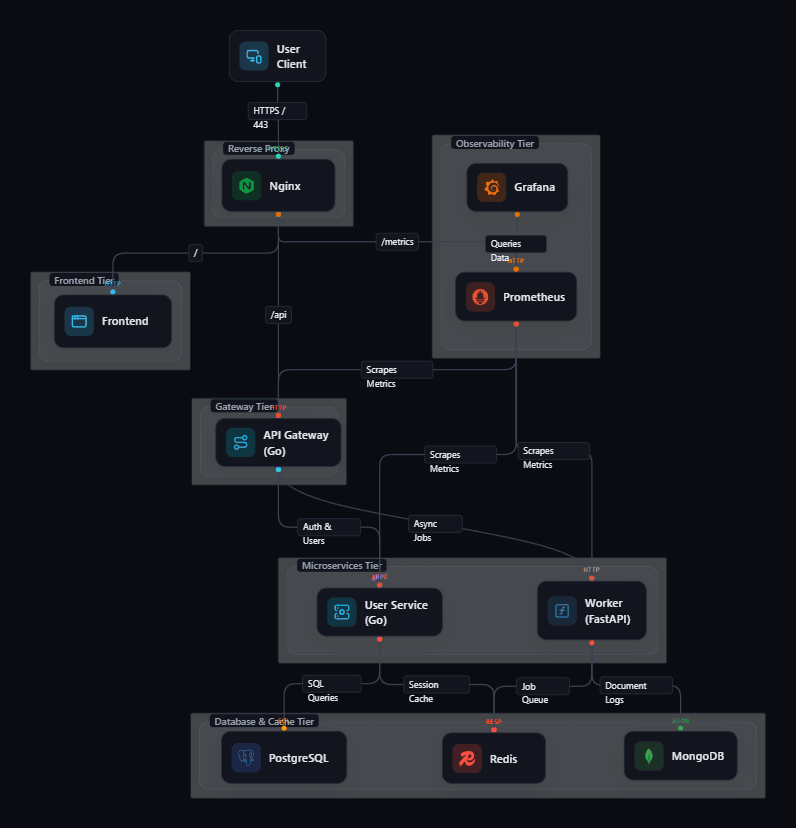

# Project 09: Multi-Tier Microservices Docker Compose and GitOps CI/CD Stack

## Overview

This project implements a production-grade 10-tier microservices application stack containerized with Docker, orchestrated using Docker Compose, and automated via a GitHub Actions CI/CD pipeline and doco-cd GitOps continuous deployment runner.

It demonstrates containerization best practices, multi-stage builds, path-filtered selective CI testing, container security scanning gates, telemetry monitoring, and zero-downtime GitOps deployments without requiring Kubernetes overhead.

---

## Architecture Overview



---

## Key Features

1. **Multi-Stage Docker Builds**: Minimal runtime footprints (`alpine`/`slim`), non-root execution (`USER appuser`), layer cache optimization, and container `HEALTHCHECK` directives.
2. **Dual Compose Configuration**:
    - `docker-compose.yml`: Production composition using Docker Hub pre-built images, network isolation, and container CPU/memory resource limits.
    - `docker-compose.dev.yml`: Local development composition supporting source code volume binds, live hot-reloading, and direct debug ports.
3. **Decoupled CI/CD Pipeline (`.github/workflows/ci.yml`)**:
    - Path Filtering: Uses `dorny/paths-filter` to detect modified service directories.
    - Decoupled Service Execution: Independent jobs per microservice (`frontend-nextjs`, `api-gateway`, `api-go-user`, `api-fastapi-worker`). Failures in one service do not block remaining services.
    - Trivy Security Scanning: Container security scan gate prior to Docker Hub image push.
    - BuildKit Parallel Caching: Concurrent image builds using GitHub Actions cache (`type=gha`).
    - Single Docker Hub Repository: Pushes pre-built images to `thesr/fullstack-prep:<service>-<short_sha>` and `:latest`.
4. **GitOps Auto-Sync & Production Orchestration**:
    - Automatic Compose Tag Updates: `update-compose-tags` pins updated 7-character commit SHAs in `docker-compose.yml` only for succeeded builds.
    - Loop Prevention: Commits tag updates back to the repository with `[skip ci]`, preventing recursive workflow triggers.
    - Production Pull Policy: Uses `pull_policy: always` in `docker-compose.yml` to pull pre-built Docker Hub images directly without local build overhead.

---

## Directory Structure

```
09-docker-compose-stack/
├── .github/workflow/ci.yml      # CI/CD Pipeline
├── .env.example                 # Centralized environment variables template
├── docker-compose.yml           # Production Docker Compose specification
├── docker-compose.dev.yml       # Local Development Docker Compose specification
├── README.md                    # Project documentation (this file)
├── DESIGN_SPEC.md               # Technical design & architecture document
├── Architechture.gravel         # Gravel Graph architectural diagram
├── Architechture.gif            # Architecture Diagram flow
├── nginx/                       # Edge reverse proxy configuration & Dockerfile
│   ├── Dockerfile
│   └── nginx.conf
├── frontend-nextjs/             # Next.js 15 Standalone Frontend App
│   ├── Dockerfile
│   ├── ...
├── api-gateway/                 # Go HTTP API Gateway
│   ├── Dockerfile
│   ├── ...
├── api-go-user/                 # Go User Microservice
│   ├── Dockerfile
│   ├── ...
├── api-fastapi-worker/          # Python FastAPI Worker
│   ├── Dockerfile
│   ├── ...
├── prometheus/                  # Prometheus scraping configuration
│   └── prometheus.yml
├── grafana/                     # Grafana dashboards & datasources provisioning
│   ├── dashboards/
│   │   └── overview.json
│   └── provisioning/
│       ├── dashboards/
│       └── datasources/
└── deploy-repo-sample/          # Sample doco-cd GitOps runner configuration
    └── doco-cd.yaml
```

---

## Setup & Getting Started Guide

### Prerequisites

Ensure you have the following installed on your machine:

- [Docker Engine](https://docs.docker.com/get-docker/) (v24.0+)
- [Docker Compose](https://docs.docker.com/compose/install/) (v2.20+)
- Git

### 1. Clone & Environment Setup

Copy the template environment file:

```bash
cd projects/09-docker-compose-stack
cp .env.example .env
```

Review and update configuration values in `.env` if necessary.

---

### 2. Local Development Mode (Hot-Reloading)

To run the stack locally with source code volume mounts and instant live hot-reloading:

```bash
docker compose -f docker-compose.dev.yml up --build -d
```

Check status of running development containers:

```bash
docker compose -f docker-compose.dev.yml ps
```

To stop development containers:

```bash
docker compose -f docker-compose.dev.yml down
```

---

### 3. Production Mode Orchestration

To build and run the complete production stack with health checks, resource constraints, network isolation, and telemetry monitoring:

```bash
docker compose up --build -d
```

Verify that all 10 containers are running and healthy:

```bash
docker compose ps
```

To view logs across all services:

```bash
docker compose logs -f
```

To stop the production stack:

```bash
docker compose down
```

---

## Endpoint & Service Reference

When the stack is running, access services at the following URLs:

| Service                  | Protocol / Port | Endpoint URL                  | Description                     |
| ------------------------ | --------------- | ----------------------------- | ------------------------------- |
| **Nginx Edge Proxy**     | HTTP / 80       | http://localhost              | Main entrypoint & proxy routing |
| **Next.js Frontend**     | HTTP / 3000     | http://localhost:3000         | Web UI Dashboard                |
| **Go API Gateway**       | HTTP / 8080     | http://localhost:8080/healthz | Gateway Health Check            |
| **Go User Service**      | HTTP / 8081     | http://localhost:8081/users   | User Microservice Endpoint      |
| **FastAPI Worker**       | HTTP / 8000     | http://localhost:8000/jobs    | Async Worker Jobs Endpoint      |
| **Prometheus Telemetry** | HTTP / 9090     | http://localhost:9090         | Metrics Scraping & Targets      |
| **Grafana Dashboard**    | HTTP / 3001     | http://localhost:3001         | Operational Monitoring UI       |

_Grafana Credentials_: User: `admin`, Password: `adminsecret` (defined in `.env`).

---

## CI/CD Pipeline & GitOps Setup

### GitHub Actions Secrets & Permissions

To enable building, pushing images, and automated tag updates in GitHub Actions, configure the following secrets and repository permissions:

- `DOCKERHUB_USERNAME`: Your Docker Hub account username.
- `DOCKERHUB_TOKEN`: Personal Access Token generated from Docker Hub.

### Continuous Deployment via doco-cd

1. Install `doco-cd` on your deployment host server.
2. Point `doco` to the sample config in `doco-cd.yaml`.
3. `doco-cd` will continuously watch for new commits in your repository and automatically execute `docker compose pull && docker compose up -d` whenever updated image tags arrive.
